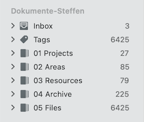
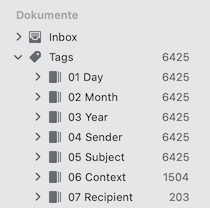

# A Quick Start Guide for Documents

## Purpose and main principles

The purpose of this solution is to establish a document management solution for personal documents with the primary goal to get paper out of the way as fast as possible, to have all files organized consistently and to be as flexible as possible regarding naming and file structure.

The solution can be best described as a DEVONthink-centric classification system and a workflow with methodological guardrails that is strongly supported by scripts for automation and integration.

A document in the context here can be best described as a typical letter-format postal document or a digital equivalent of it. This kind of documents usually comes from a specific sender, does have a specific date as well as your name and your address as the recipient on it - in opposite to some other kind of documents like e.g. e-books, magazines, manuals, Office documents, emails etc. 

The solution supports and encourages the usage in combination with [Inbox Zero](https://www.youtube.com/watch?v=z9UjeTMb3Yk) and the [PARA Method](https://fortelabs.com/blog/para/).

## Database layout and top level folder structure

The solution has no specific requirements on database setup or layout (like the number of databases or the functional configuration of the databases) but it works on database level and it requires two specific folders:

- an **Inbox folder**, where all the documents comes in. In terms of DEVONthink, the Inbox folder of a database is the best choice for it (but not the Global Inbox).
- a **Files folder**, where all documents will be filed when leaving the Inbox. Your can think about it as an archive folder, but I don't want to name it archive because of the second A in PARA.

When practicing PARA the top level group structure in DEVONthink could looks like this:



## The workflow in a nutshell 

The most crucial aspect of the solution is the workflow from importing until archiving of documents. This workflow consists of five steps: 

1. **Import Document**: Import and move the document to the Inbox of the destination database.
2. **Classify Document**: Do the classification. This will be done through tags (with auto-tagging support for Date, Sender, Subject and Context)
3. **Set Name and Metadata**: This sets the file name and a set of metadata for further usage - based on classification tags.
4. **Check Metadata & Add individual Information**: Check classification and add additional information where needed (with PopClip support), for example:
	- adjust tags, add additional text to better describe the document
	- mark a document for later reference when needed (e.g. with flags, labels etc.)
5. **Archive Document**:  Move the document to the Files folder and lock the document.

Steps 1-3 and 5 can be completely automated. Step 4 could be skipped but is considered as a dedicated step / conscious decision to add quality assurance, before a document is moved from the Inbox to the files folder - which means it is not in focus anymore.

The scripts needed for doing this will be described in a seconds, but before continue let's first have a look which DEVONthink features and capabilities are used and for what.

## Which DEVONthink features are used and for what

Only a small piece of DEVONthink features are used by the solution itself but they are crucial. The following features are used:

- **Tags**: Tags in DEVONthink can be hierarchaly structrued but does not have much more capabilities. A classification system is added throught Tag Groups and Tags.
- **Custom Metadata**: DEVONthink comes with Custom Metadata to store, well, custom metadata. Some Custom Metadata fields are added to store classification data, with the option to add individual information.
- **Scripting & Automation**: Scripting support is a first class citizen in DEVONthink. Scripting is used to implement the workflow through Smart Rules, Scriptig Menu script (wich offers keyboard shortcuts) and under the hood to access document properties, move documents and so on.

### Classification system (Tags)

Tags are used to implement a (multi-dimensional) classification system where Tag Groups are used to implement _dimensions_ and Tags within the tag groups are used to implement _categories_. The following dimensions has been added through tag groups:

- **Day**: Days is used to represents the logical day of a document. 
	- Days are named 01, 02 ... 31.
- **Month**: Months is used to represents the logical month of a document. 
	- Months are named Januar, Februar ... Dezember.
- **Year**: Years are used to represents the logical year of a document. 
	- Years are named 2026, 2025 ...
- **Sender**: Senders are used to represent the sender / originator of a document. This can be company name, a representative category for individual documents like Retail, Travel or Service etc.
	- Tags can be named any way (following the usually best practices is recommended).
-  **Subject**: Subjects are used to represent the subject category of a document, like Invoice, Contract, Payslip or super-generic ones like Information.
	- like senders, subjects can be named any way
- **Context**: Contexts are used as an additional piece of information for cases where Sender and Subject are not unique for a specific time period (e.g. when you get more than one monthly invoice from the same sender) or when a different view is helpful (e.g. a contract number or a license plate).
	- like senders and subjects, contexts can be named any way

The Day, Month and Year dimensions will be also refered as Date some times in the following. One note on this: The reason to implement a Date that way is quite simple and does have a historical background. DEVONthink's document date feature was not there at the time where I went paperless for all(most all) of my documents - but they have always been filed by date somehow, physically. Scanning a chuck of documents for a known time period and tagging it accordingly, maybe only with a valid year and month in a first iteration, was super fast. Over time a stucked with that structure.

The dimension tag groups are excluded from tagging. The name of the dimentsion tag groups can be configured. 

The top level Tags group in DEVONthink could looks like this:



### Custom Metadata
 
Custom Metadata are used to be able to:

- show classification information from tags in a structured and condensed way 
- store additional information for Sender and Subject - right beside to the category itself 
- store additional data extracted from the document like document amount
 
The following Custom Metadata fields has been added:

- **Date**: A field of type Date to represent the document date from the tags.
- **Sender**: A field of type 'Single-line Text' to show the Sender tag with the option to add individual text.
- **Subject**: A field of type 'Single-line Text' to show the Subject tag and additional tags and fields when applicable. Also with the option to add individual text.
- **Betrag**: A field of type 'Decimal Number' with format 'Currency'  to show the document amount for specified subjects.

### Scripting & Automation

AppleScript scripts are used to implement the solution and for automation of the workflow. For automation menu bar scripts, a Smart Rule and a PopClip script has been created. 

The following scripts has been created to be added to the Scripts menu:

- **Classify Records** ⌃⇧⌘C:  Classify records. At least one record must be selected.
- **Set Name and Metadata** ⌃⇧⌘U: Set record name and updates metadata. At least one record must be selected.
- **Archive Records** ⌃⇧⌘A: Move record to archive folder. At least one record must be selected.
- **Verify Records** ⌃⇧⌘V: Start verification of record tags, field values and formats.

The following script has been created to be attached to a Smart Rule:

- **Rule - Process Document**: This does the classification and set name and metadata in one step.

The following scripts has been created to be installed as PopClip extension:

- **dt-set-subject.popcliptxt**: This adds the selected text to the subject field.

The application and integration logic are contained in the following script libraries:

- **DocLibrary**: This library contains the application logic for the Documents workflow and the integration with DEVONthink.
- **BaseLibrary**: This library contains shared logic which is also used in other workflows.
- **PopClipLibrary** This library contains integration logic with PopClip.
- **Logger**: A very simple logger.

## Naming Schema and Custom Metadata Field Formats

When a document is tagged according to the classification system, the file name will be set in this format: 

`[YYYY]-[MM]-[DD]_[Sender]_[Subject].extension`

The corresponding tags will be used straight-forward, except for month, where the name is mapped to a double-digit number. 

The field seperators between the dimensions are configurable.   

The Custom Metadata 'Sender' and 'Subject' will be set to the corresponding tag values (categories) as well but with the option to add individual information. This is usefull to add additional text which will not change - even when you change the tags, rename the document and update the Custom Metadata fields. To add inividual text you have to add a special field separator after the tag value / category, which is by default the ":" character.

The Custom Metadata 'Subject' is used to show something more on information. When available the following information will be showed in squared brackets on the right-hand side:

- when a Context is set it will be displayed 
- when a document amount was set it will be displayed 
- when specific tags are set, theses tags will be displayed

For example, the 'Subject' field could show text in the following formats:

- `[Subject]` 
- `[Subject]: Some additional information` When additional text was added.
- `[Subject] [EUR 19,95]` When a document amount was found.
- `[Subject] [Context]` When a Context tag was found.
- `[Subject] [Sent]` When a document was set as sent.
- `[Subject]: Some Text [EUR 19,95][Context]` A combination with additional text, document amount and context.

The Custom Metadata field 'Date' will always be set to the document date from the tags.

The Custom Metadata field 'Betrag' will be set to the document amount, but only when empty. 

## This is how it looks like

The following video shows the classification, name & custom metadata update and the PopClip script to add text to the subject field in action. The subject will be updated two times: first after the import and the second time triggered by the PopClip action.

[](https://vimeo.com/1164940198)

The classification and the name & custom metadata udpate was triggered by an 'on import' Smart Rule. For paper scans this is quite similar, except that in paper scenarios all scans arrive in the Global Inbox and will be moved to the Inbox of the destination database by Smart Rules which checks for specific keywords.

## Installation and initial configuration

In order to install the solution you need to clone the repo, set the path on your local environment and configure a database.

**Prerequistes**: If osagitfilter isn't installed, this needs to be installed first. [Osagitfilter](https://github.com/doekman/osagitfilter) is required to work with AppleScript files through git. When osagitfilter is installed continue as described in the following.

1. Clone the MailScripts repository to any folder on your machine:

	``` bash
	git clone https://github.com/s17n/MailScripts.git
	```

2. Configure the MailScript path according to your local installation:

	- Copy `Configuration/config.scpt` to `~/.mailscripts/config.scpt`  
	- Change the following line in  ~/.mailscripts/config.scpt to your local installation: 

		``` AppleScript
		property pMailScriptsPath : "/Users/.../Projects/MailScripts"  
		```

3. Mark the database you want to use according to the solution: 

	- Copy/Paste `Template-Documents.scpt` to same folder and
	- Rename it to `Database-Configuration-YOUR_DATABASE_NAME.scpt`

## And what about the PARA folders?

[tbd]
