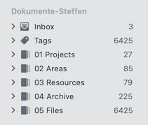
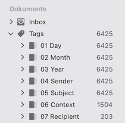

# A Quick Start Guide for Documents

## Purpose and main principles

The purpose of this solution is to establish a document management solution for personal documents with the primary goal to get paper out of the way as fast as possible, to have all files organized consistently and to be as flexible as possible regarding naming and file structure.

The solution can be best described as a DEVONthink-centric classification system and a workflow with methodological guardrails that is strongly supported by scripts for automation and integration.

A document in the context here can be best described as a typical letter-format postal document or a digital equivalent of it. This kind of documents usually comes from a specific sender, does have a specific date as well as your name and your address as the recipient on it - in opposite to some other kind of documents like e.g. e-books, magazines, manuals, Office documents, emails etc. 

The solution supports and encourages the usage in combination with [Inbox Zero](https://www.youtube.com/watch?v=z9UjeTMb3Yk) and the [PARA Method](https://fortelabs.com/blog/para/).

## Database layout and top level folder structure

The solution does not have any special requirements on database structure or layout (like the number of databases or the functional configuration of the databases) but it works on database level and it requires two specific folders:

- an **Inbox folder**, where the documents comes in and where a Smart Rule can be attached. In terms of DEVONthink, the Inbox folder of a database is the best choice for it (but not the Global Inbox).
- a **Files folder**, where all documents will be filed when leaving the Inbox. Your can think about it as an archive folder, but I don't want to name it archive because of the second A in PARA.

When practicing PARA the top level groups structure in DEVONthink could look like this:



## The workflow in a nutshell 

The most crucial aspect of the solution is the workflow from importing until archiving of documents. This workflow consists of five steps: 

1. **Import Document**: Import and move the document to the Inbox of the destination database.
2. **Classify Document**: Do the classification. This will be done through tags (with auto-tagging support for Date, Sender, Subject and Context)
3. **Set Name and Metadata**: This sets the file name and a set of metadata for further usage - based on classification tags.
4. **Check Metadata & Add individual Information**: Check classification and add additional information where needed (with PopClip support), for example:
	- adjust tags, add additional text to better describe the document
	- mark a document for later reference when needed (e.g. with flags, labels etc.)
5. **Archive Document**:  Move the document to the Files folder and lock the document.

Steps 1-3 and 5 can be completely automated. Step 4 could be skipped but is considered as a dedicated step / conscious decision to add quality assurance, before a document is moved from the Inbox to the files folder - which means it is not in focus anymore.

The scripts needed for doing this will be described in a seconds, but before continue let's first have a look which DEVONthink features and capabilities are used and for what.

## Which DEVONthink features are used and for what

Only a small piece of DEVONthink features are used by the solution itself but they are crucial. The following features are used:

- **Tags**: Tags in DEVONthink can be structured hierarchically, but they do not provide much behavior on their own. This solution adds a classification system on top of Tag Groups and Tags.
- **Custom Metadata**: DEVONthink comes with Custom Metadata to store, well, custom metadata. Some Custom Metadata fields are added to store classification data, with the option to add individual information.
- **Scripting & Automation**: Scripting support is a first-class DEVONthink feature. The workflow uses scripts through Smart Rules, Script Menu scripts (including keyboard shortcuts), and internal automation for document properties, document moves, and related operations.

### Classification system (Tags)

Tags are used to implement a multi-dimensional classification system. Top-level Tag Groups implement _dimensions_; tags within these top-level tag groups implement _dimension values_. The default document configuration defines these dimensions:

- **Day**: Represents the logical day of a document.
	- Days are named 01, 02 ... 31.
- **Month**: Represents the logical month of a document.
	- Months are named Januar, Februar ... Dezember.
- **Year**: Represents the logical year of a document.
	- Years are named 2026, 2025 ...
- **Sender**: Senders are used to represent the sender/originator of a document. This can be a company name or a representative dimension value for individual documents like Retail, Travel, or Service.
	- Tags can be named freely. Following a consistent naming convention is recommended.
- **Subject**: Subjects are used to represent the subject dimension value of a document, like Invoice, Contract, Payslip, or generic values like Information.
	- Like senders, subjects can be named freely.
- **Context**: Contexts are used as an additional piece of information for cases where Sender and Subject are not unique for a specific time period (e.g. when you get more than one monthly invoice from the same sender) or when a different view is helpful (e.g. a contract number or a license plate).
	- Like senders and subjects, contexts can be named freely.

The Day, Month, and Year dimensions are referred to as the Date dimensions below.

Note: The date model has a historical background. DEVONthink's document date feature was not available when this workflow was first created, while the existing paper archive was already filed by date. Scanning a batch of documents for a known time period and tagging it with year and month was fast, so the structure stayed.

The dimension tag groups themselves are excluded from tagging. Dimension tag group names can be configured.

With this classification system, the top-level Tags group in DEVONthink can look like this:



### Custom Metadata
 
Custom Metadata is used to:

- show classification information from tags in a structured and condensed way
- store additional information for Sender and Subject right beside the dimension value itself
- store additional data extracted from the document like document amount

The following Custom Metadata fields have been added:

- **Date**: A field of type Date to represent the document date from dimension values.
- **Sender**: A field of type 'Single-line Text' to show the Sender dimension value with the option to add individual text.
- **Subject**: A field of type 'Single-line Text' to show the Subject dimension value and additional tags and fields when applicable. Also with the option to add individual text.
- **Betrag**: A field of type 'Decimal Number' with format 'Currency' to show the document amount for specified subjects.

### Scripting & Automation

AppleScript scripts implement the solution and automate the workflow. The automation uses menu bar scripts, Smart Rules, and a PopClip script.

The following scripts can be added to the Scripts menu:

- **Classify Records** ⌃⇧⌘C: Classifies records. At least one record must be selected.
- **Set Name and Metadata** ⌃⇧⌘U: Sets the record name and updates metadata. At least one record must be selected.
- **Archive Records** ⌃⇧⌘A: Moves records to the archive folder. At least one record must be selected.
- **Verify Records** ⌃⇧⌘V: Verifies records under `/05 Files` against configured `pDimensionsConstraints` (expected number of dimension values per dimension). Violations are written to the log and affected records are marked.
- **Open Year / Sender / Subject / Context** ⌥⇧⌘3 / ⌥⇧⌘4 / ⌥⇧⌘5 / ⌥⇧⌘6: With one selected record, resolves the target value and opens (or creates) the corresponding smart group in the configured smart-groups folder; with no selected record, shows an alphabetically sorted chooser with existing smart groups under the configured `smartgroupsFolder` and opens the selected smart group.
- **Open Label** ⌥⇧⌘L: Opens (or creates) a smart group for a DEVONthink label under `03 Resources/Label`. Label smart groups are named `Number-Label Name`, for example `3-Action needed`. If one record is selected and it already has a label, that label is used directly. Otherwise, the script always shows a label chooser and then creates or opens the smart group for the chosen label.

The following script can be attached to a Smart Rule:

- **Rule - Process Document**: Runs classification, naming, and metadata updates in one step.

The following script can be installed as a PopClip extension:

- **dt-set-subject.popcliptxt**: This adds the selected text to the subject field.

The application and integration logic are contained in the following script libraries:

- **DocLibrary**: This library contains the application logic for the Documents workflow and the integration with DEVONthink.
- **BaseLibrary**: This library contains shared logic which is also used in other workflows.
- **PopClipLibrary** This library contains integration logic with PopClip.
- **Logger**: A very simple logger.

## Naming Schema and Custom Metadata Field Formats

When a document is tagged according to the classification system, the file name will be set in this format:

`[YYYY]-[MM]-[DD]_[Sender]_[Subject].extension`

The corresponding dimension values are used directly, except for month, where the name is mapped to a double-digit number.

Field separators between dimensions are configurable.

The Custom Metadata fields 'Sender' and 'Subject' are set to the corresponding dimension values and can include individual text. This is useful for text that should stay unchanged when tags change, record names are updated, and Custom Metadata fields are refreshed. To add individual text, add the configured field separator after the dimension value. The default separator is `: `.

The Custom Metadata field 'Subject' can include additional information. When available, the following values are shown in square brackets on the right-hand side:

- when a Context is set, it is displayed
- when a document amount is set, it is displayed
- when specific tags are set, these tags are displayed

For example, the 'Subject' field could show text in the following formats:

- `[Subject]` 
- `[Subject]: Some additional information` When additional text was added.
- `[Subject] [EUR 19,95]` When a document amount was found.
- `[Subject] [Context]` When a Context tag was found.
- `[Subject] [Sent]` When a document was set as sent.
- `[Subject]: Some Text [EUR 19,95][Context]` A combination with additional text, document amount and context.

The Custom Metadata field 'Date' will always be set to the document date from the tags.

The Custom Metadata field 'Betrag' will be set to the document amount, but only when empty. 

## This is how it looks like

The following video shows the classification, name & custom metadata update and the PopClip script to add text to the subject field in action. The subject will be updated two times: first after the import and the second time triggered by the PopClip action.

[](https://vimeo.com/1164940198)

The classification and the name & custom metadata udpate was triggered by an 'on import' Smart Rule. For paper scans this is quite similar, except that in paper scenarios all scans arrive in the Global Inbox and will be moved to the Inbox of the destination database by Smart Rules which checks for specific keywords.

## Installation and configuration

In order to install the solution you need to clone the repo, set the path on your local environment and configure a database.

**Prerequisites**: If osagitfilter isn't installed yet, this needs to be done first. [Osagitfilter](https://github.com/doekman/osagitfilter) is required in order to work with AppleScript files in git. When osagitfilter is installed continue as described in the following.

1. Clone the MailScripts repository to any folder on your machine:

	``` bash
	git clone https://github.com/s17n/MailScripts.git
	```

2. Set the MailScripts path according to your local installation:

	- Copy `Configuration/config.scpt` to `~/.mailscripts/config.scpt`  and
	- Change the following line in  ~/.mailscripts/config.scpt to your local installation: 

		``` AppleScript
		property pMailScriptsPath : "/Users/.../Projects/MailScripts"  
		```

3. Set the database you want to use: 

	- Make a copy of `Template-Documents.scpt` to the same folder and
	- Rename it to `Database-Configuration-YOUR_DATABASE_NAME.scpt`

## And what about the PARA folders?

In a nutshell, a good fit for me is working with:

- `Replicants` for Projects and
- `Smart Groups`for Areas 
