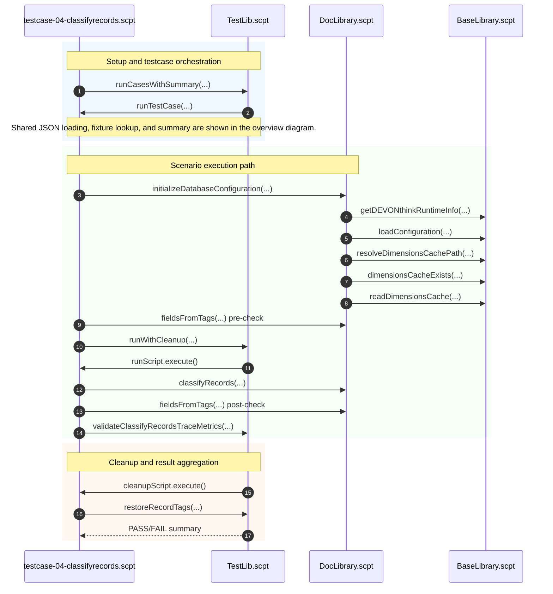

# Testcase 04 Sequence Diagram (Reduced)

```mermaid
sequenceDiagram
    autonumber
    participant TC04 as testcase-04-classifyrecords.scpt
    participant TestLib as TestLib.scpt
    participant DocLib as DocLibrary.scpt
    participant BaseLib as BaseLibrary.scpt

    rect rgb(240, 248, 255)
        Note over TC04,TestLib: Setup and testcase orchestration
        TC04->>TestLib: runCasesWithSummary(...)
        TestLib->>TC04: runTestCase(...)
        Note over TC04,TestLib: Shared JSON loading, fixture lookup, and summary are shown in the overview diagram.
    end

    rect rgb(245, 255, 245)
        Note over TC04,DocLib: Scenario execution path
        TC04->>DocLib: initializeDatabaseConfiguration(...)
        DocLib->>BaseLib: getDEVONthinkRuntimeInfo(...)
        DocLib->>BaseLib: loadConfiguration(...)
        DocLib->>BaseLib: resolveDimensionsCachePath(...)
        DocLib->>BaseLib: dimensionsCacheExists(...)
        DocLib->>BaseLib: readDimensionsCache(...)

        TC04->>DocLib: fieldsFromTags(...) pre-check
        TC04->>TestLib: runWithCleanup(...)
        TestLib->>TC04: runScript.execute()
        TC04->>DocLib: classifyRecords(...)
        TC04->>DocLib: fieldsFromTags(...) post-check
        TC04->>TestLib: validateClassifyRecordsTraceMetrics(...)
    end

    rect rgb(255, 248, 240)
        Note over TC04,TestLib: Cleanup and result aggregation
        TestLib->>TC04: cleanupScript.execute()
        TC04->>TestLib: restoreRecordTags(...)
        TestLib-->>TC04: PASS/FAIL summary
    end
```
