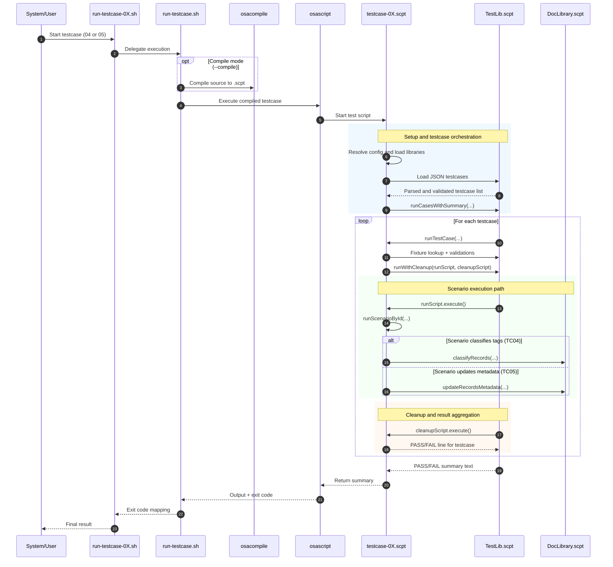

# Testcases Sequence Overview

```mermaid
sequenceDiagram
    autonumber
    participant Dev as System/User
    participant Runner as run-testcase-0X.sh
    participant SharedRunner as run-testcase.sh
    participant Compiler as osacompile
    participant OSA as osascript
    participant Test as testcase-0X.scpt
    participant TestLib as TestLib.scpt
    participant DocLib as DocLibrary.scpt

    Dev->>Runner: Start testcase (04 or 05)
    Runner->>SharedRunner: Delegate execution

    opt Compile mode (--compile)
        SharedRunner->>Compiler: Compile source to .scpt
    end

    SharedRunner->>OSA: Execute compiled testcase
    OSA->>Test: Start test script

    rect rgb(240, 248, 255)
        Note over Test,TestLib: Setup and testcase orchestration
        Test->>Test: Resolve config and load libraries
        Test->>TestLib: Load JSON testcases
        TestLib-->>Test: Parsed and validated testcase list
        Test->>TestLib: runCasesWithSummary(...)
    end

    loop For each testcase
        TestLib->>Test: runTestCase(...)
        Test->>TestLib: Fixture lookup + validations
        Test->>TestLib: runWithCleanup(runScript, cleanupScript)

        rect rgb(245, 255, 245)
            Note over Test,DocLib: Scenario execution path
            TestLib->>Test: runScript.execute()
            Test->>Test: runScenarioById(...)
            alt Scenario classifies tags (TC04)
                Test->>DocLib: classifyRecords(...)
            else Scenario updates metadata (TC05)
                Test->>DocLib: updateRecordsMetadata(...)
            end
        end

        rect rgb(255, 248, 240)
            Note over Test,TestLib: Cleanup and result aggregation
            TestLib->>Test: cleanupScript.execute()
            Test-->>TestLib: PASS/FAIL line for testcase
        end
    end

    TestLib-->>Test: PASS/FAIL summary text
    Test-->>OSA: Return summary
    OSA-->>SharedRunner: Output + exit code
    SharedRunner-->>Runner: Exit code mapping
    Runner-->>Dev: Final result
```
