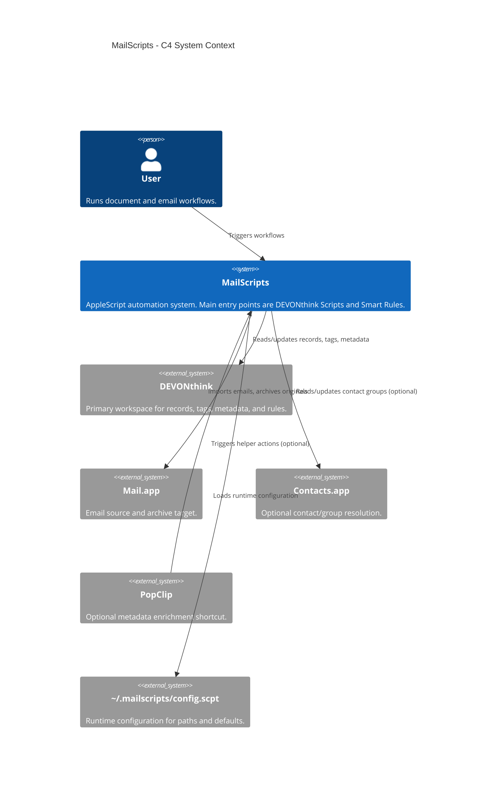
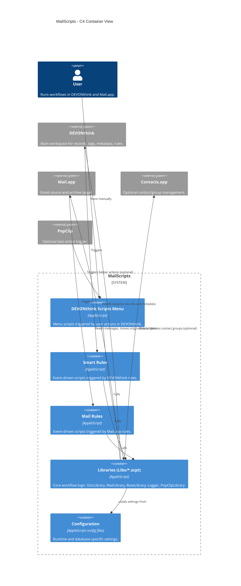
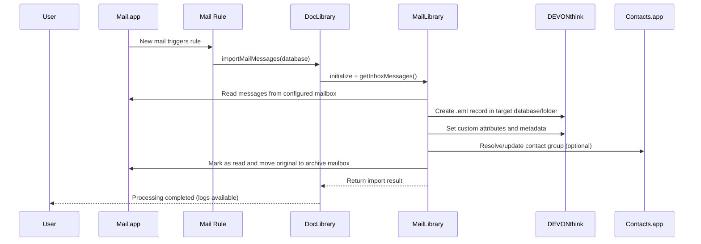
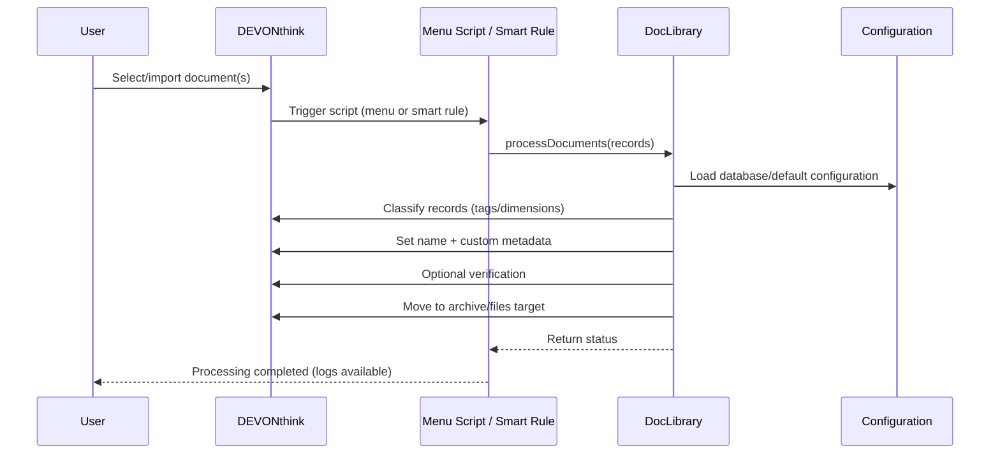

# Architecture Diagrams

This document contains four practical views of the MailScripts architecture:

1. System context
2. Container view
3. Email import sequence
4. Document processing sequence

## 1) System Context

## 2) Container View

## 3) Sequence: Email Import

## 4) Sequence: Document Processing

