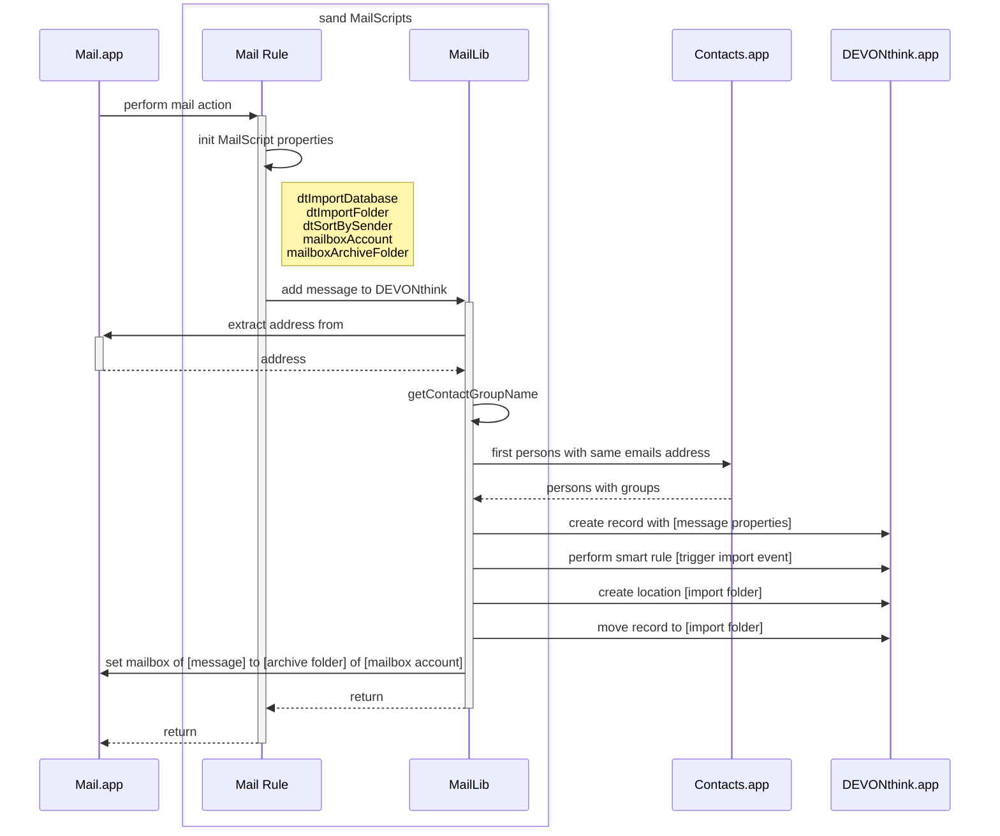

# Import Email Workflow

Emails can be imported into DEVONthink via push or pull mechanism from Apple Mail.app. The push import is trigged by a rule in Apple Mail.app - the pull import can requested from DEVONthink. Usually push import works fine, but sometimes, e.g. when reading emails first on mobile, the mail rules doesn't fire anymore, so they can be imported via pull. 

The following chart shows how the push import works:

