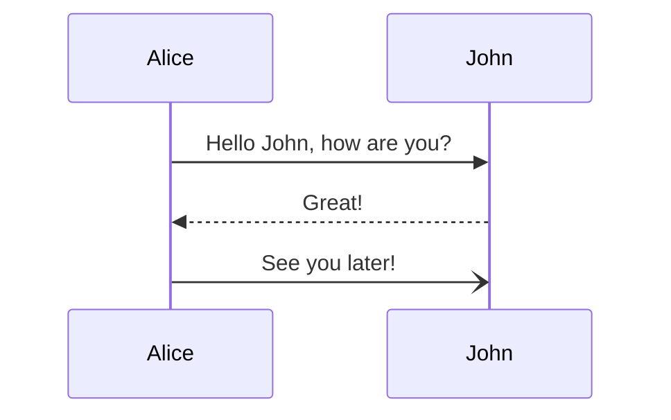

title: Import E-Mail Workflow Documentation

# Import Email

Emails can be imported into DEVONthink via push or pull mechanism. The push import is trigged by a rule in Apple Mail.app. The pull import can requested from DEVONthink.

The following chart shows how the push import works:

