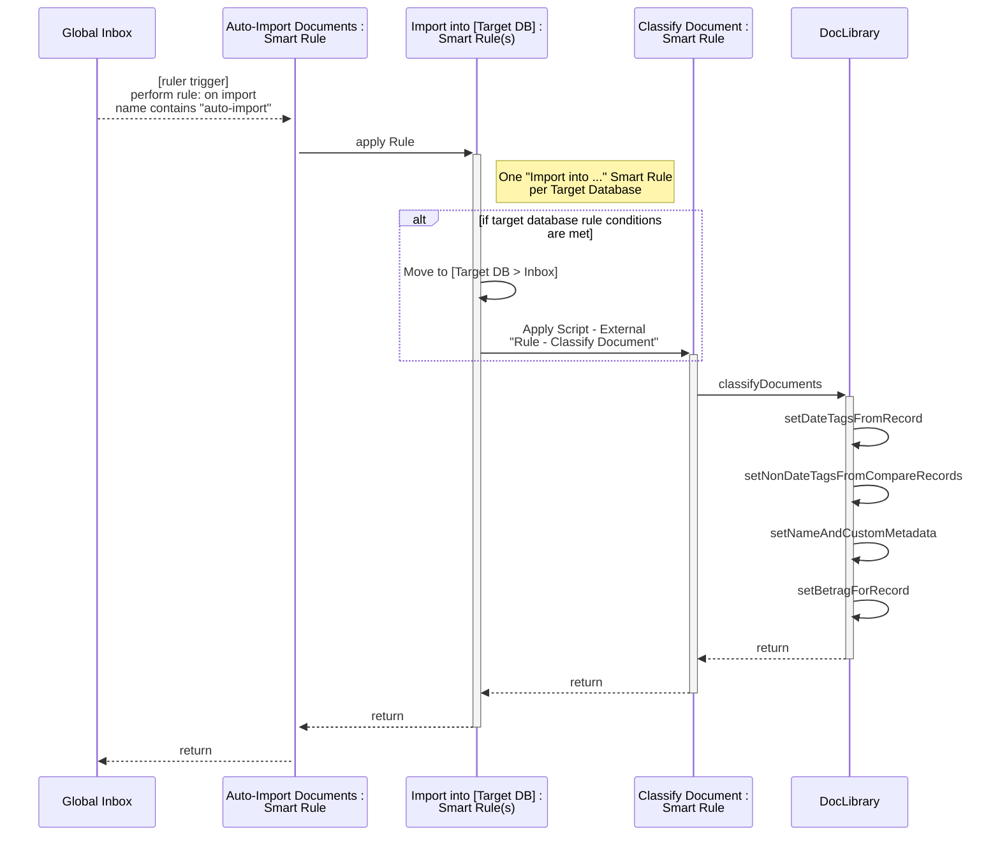

# Move to Target Database & Classify Document

```mermaid 

sequenceDiagram

	participant GI as Global Inbox
	participant DI-SR as Auto-Import Documents : <br> Smart Rule
	participant LU-SR as Import into [Target DB] : <br> Smart Rule(s)
	participant CD-R as Classify Document : <br>Smart Rule
	participant DocLib as DocLibrary
	
	GI-->>+DI-SR: [ruler trigger] <br> perform rule: on import <br>name contains "auto-import" 
	DI-SR->>+LU-SR:apply Rule
	note right of LU-SR:One "Import into ..." Smart Rule <br>per Target Database 
	alt if target database rule conditions are met
		LU-SR->>LU-SR:Move to [Target DB > Inbox]
		LU-SR->>+CD-R:Apply Script - External <br> "Rule - Classify Document"
	end 
	CD-R->>+DocLib:classifyDocuments
		DocLib->>DocLib: setDateTagsFromRecord
		DocLib->>DocLib: setNonDateTagsFromCompareRecords
		DocLib->>DocLib: setNameAndCustomMetadata
		DocLib->>DocLib: setBetragForRecord
	DocLib-->>-CD-R:return
	CD-R-->>-LU-SR:return
	LU-SR-->>-DI-SR:return
	DI-SR-->>GI:return
	


```