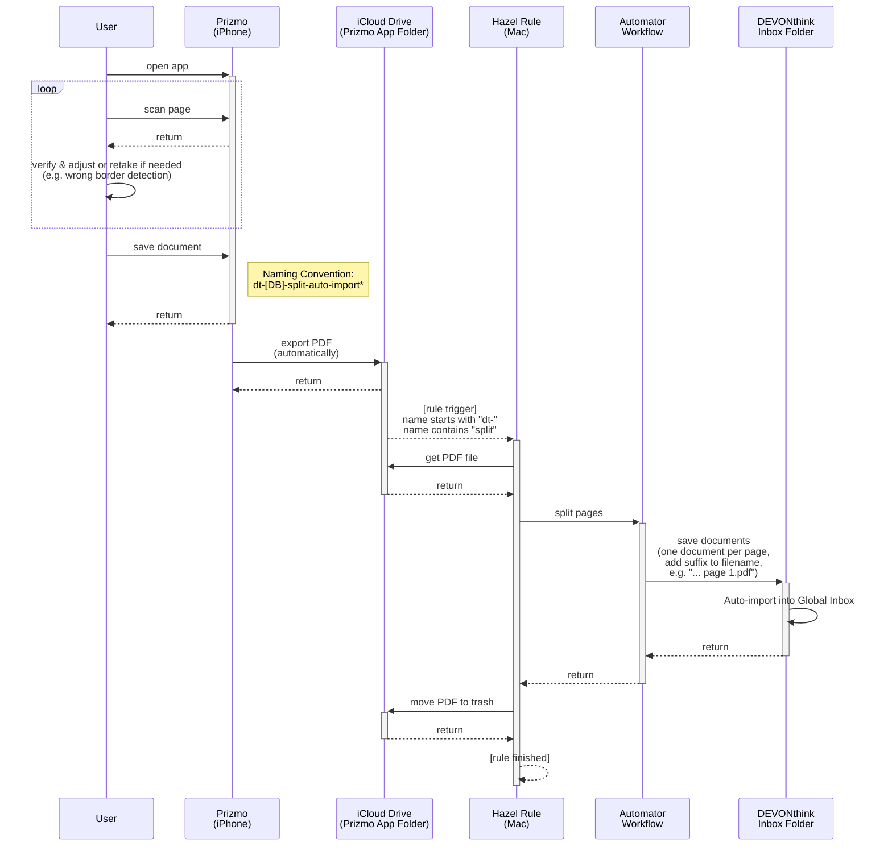

# Scan & Import from iPhone Workflow

```mermaid 

sequenceDiagram

	participant U as User
	participant P as Prizmo <br> (iPhone)
	participant I as iCloud Drive <br> (Prizmo App Folder)
	participant H as Hazel Rule <br> (Mac)
	participant A as Automator <br> Workflow
	participant IF as DEVONthink <br>Inbox Folder 
	
	U->>+P: open app
	loop
		U->>P: scan page
		P-->>U: return
		U->>U:verify & adjust or retake if needed <br> (e.g. wrong border detection)
	end 
	U->>P: save document
	Note right of P: Naming Convention: <br> dt-[DB]-split-auto-import*
	P-->>-U: return
	P->>+I: export PDF <br> (automatically)
	I-->>P: return
	I-->>+H: [rule trigger] <br> name starts with "dt-" <br> name contains "split"
	H->>I: get PDF file
	I-->>-H: return
	H->>+A: split pages
	A->>+IF: save documents <br> (one document per page, <br> add suffix to filename, <br> e.g. "... page 1.pdf")
	IF->>IF: Auto-import into Global Inbox
	IF-->>-A: return
	A-->>-H: return
	H->>+I:move PDF to trash
	I-->>-H:return
	H-->>-H: [rule finished]

```