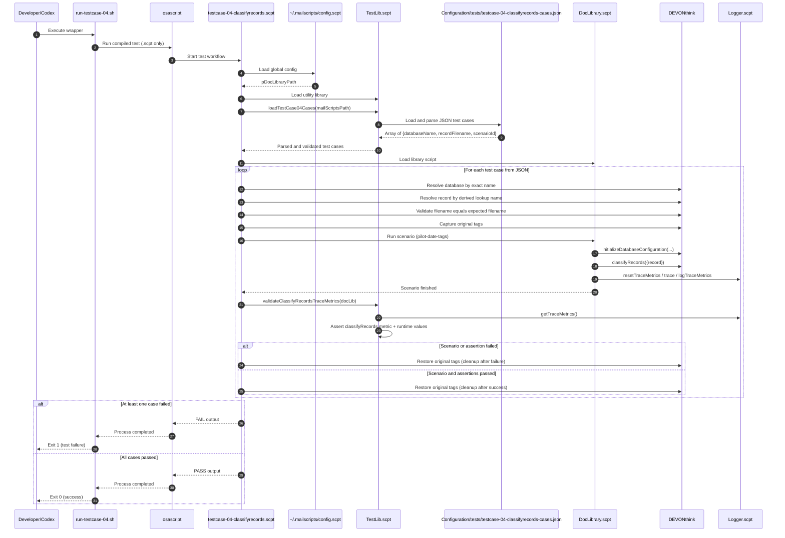

# Testcase 04 Sequence Diagram

```mermaid
sequenceDiagram
    autonumber
    participant Dev as Developer/Codex
    participant Runner as run-testcase-04.sh
    participant OSAScript as osascript
    participant Test as testcase-04-classifyrecords.scpt
    participant Config as ~/.mailscripts/config.scpt
    participant TestLib as TestLib.scpt
    participant CasesJson as Configuration/tests/testcase-04-classifyrecords-cases.json
    participant DocLib as DocLibrary.scpt
    participant DTP as DEVONthink
    participant Logger as Logger.scpt

    Dev->>Runner: Execute wrapper
    Runner->>OSAScript: Run compiled test (.scpt only)
    OSAScript->>Test: Start test workflow

    Test->>Config: Load global config
    Config-->>Test: pDocLibraryPath
    Test->>TestLib: Load utility library
    Test->>TestLib: loadTestCase04Cases(mailScriptsPath)
    TestLib->>CasesJson: Load and parse JSON test cases
    CasesJson-->>TestLib: Array of {databaseName, recordFilename, scenarioId}
    TestLib-->>Test: Parsed and validated test cases
    Test->>DocLib: Load library script

    loop For each test case from JSON
        Test->>DTP: Resolve database by exact name
        Test->>DTP: Resolve record by derived lookup name
        Test->>DTP: Validate filename equals expected filename
        Test->>DTP: Capture original tags

        Test->>DocLib: Run scenario (pilot-date-tags)
        DocLib->>DTP: initializeDatabaseConfiguration(...)
        DocLib->>DTP: classifyRecords({record})
        DocLib->>Logger: resetTraceMetrics / trace / logTraceMetrics
        DocLib-->>Test: Scenario finished

        Test->>TestLib: validateClassifyRecordsTraceMetrics(docLib)
        TestLib->>Logger: getTraceMetrics()
        TestLib->>TestLib: Assert classifyRecords metric + runtime values

        alt Scenario or assertion failed
            Test->>DTP: Restore original tags (cleanup after failure)
        else Scenario and assertions passed
            Test->>DTP: Restore original tags (cleanup after success)
        end
    end

    alt At least one case failed
        Test-->>OSAScript: FAIL output
        OSAScript-->>Runner: Process completed
        Runner-->>Dev: Exit 1 (test failure)
    else All cases passed
        Test-->>OSAScript: PASS output
        OSAScript-->>Runner: Process completed
        Runner-->>Dev: Exit 0 (success)
    end
```
