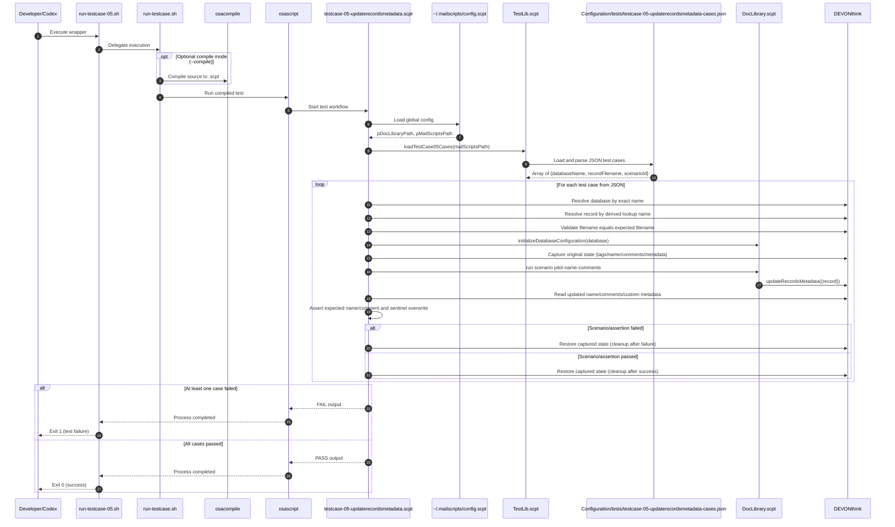

# Testcase 05 Sequence Diagram

```mermaid
sequenceDiagram
    autonumber
    participant Dev as Developer/Codex
    participant Runner as run-testcase-05.sh
    participant SharedRunner as run-testcase.sh
    participant Compiler as osacompile
    participant OSAScript as osascript
    participant Test as testcase-05-updaterecordsmetadata.scpt
    participant Config as ~/.mailscripts/config.scpt
    participant TestLib as TestLib.scpt
    participant CasesJson as Configuration/tests/testcase-05-updaterecordsmetadata-cases.json
    participant DocLib as DocLibrary.scpt
    participant DTP as DEVONthink

    Dev->>Runner: Execute wrapper
    Runner->>SharedRunner: Delegate execution
    opt Optional compile mode (--compile)
        SharedRunner->>Compiler: Compile source to .scpt
    end
    SharedRunner->>OSAScript: Run compiled test
    OSAScript->>Test: Start test workflow

    Test->>Config: Load global config
    Config-->>Test: pDocLibraryPath, pMailScriptsPath
    Test->>TestLib: loadTestCase05Cases(mailScriptsPath)
    TestLib->>CasesJson: Load and parse JSON test cases
    CasesJson-->>TestLib: Array of {databaseName, recordFilename, scenarioId}

    loop For each test case from JSON
        Test->>DTP: Resolve database by exact name
        Test->>DTP: Resolve record by derived lookup name
        Test->>DTP: Validate filename equals expected filename

        Test->>DocLib: initializeDatabaseConfiguration(database)
        Test->>DTP: Capture original state (tags/name/comments/metadata)
        Test->>DocLib: run scenario pilot-name-comments

        DocLib->>DTP: updateRecordsMetadata({record})
        Test->>DTP: Read updated name/comments/custom metadata
        Test->>Test: Assert expected name/comment and sentinel overwrite

        alt Scenario/assertion failed
            Test->>DTP: Restore captured state (cleanup after failure)
        else Scenario/assertion passed
            Test->>DTP: Restore captured state (cleanup after success)
        end
    end

    alt At least one case failed
        Test-->>OSAScript: FAIL output
        OSAScript-->>Runner: Process completed
        Runner-->>Dev: Exit 1 (test failure)
    else All cases passed
        Test-->>OSAScript: PASS output
        OSAScript-->>Runner: Process completed
        Runner-->>Dev: Exit 0 (success)
    end
```
