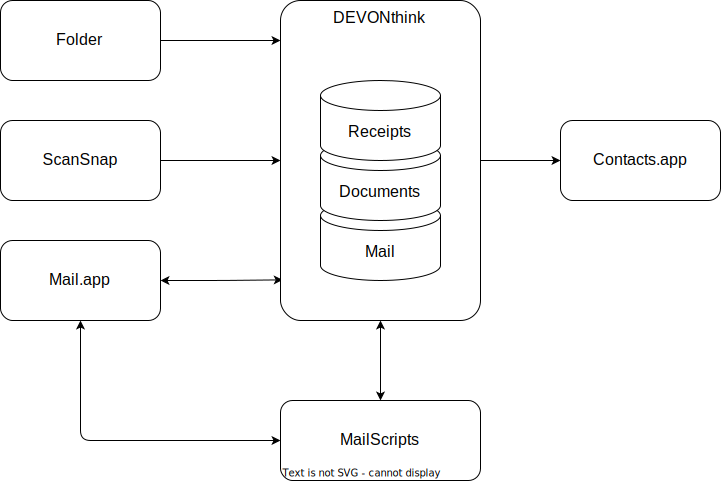

# MailScripts

The MailScripts project is a collection of Apple Scripts to integrate various MacOS applications with DEVONthink to support and automate my daily document and email management workflows.

## Overview

DEVONthink is my leading system for email and document management. For email each mail message is treated as document (or record) in DEVONthink. Apple's Mail.app is mostly used under the hood for receiving and for composing and sending emails (technically speaking I only work with Mail.app's message windows - I don't work with the viewer window). This sounds complicated and, of course, working with two apps is more complex than working with one, but, since DEVONthink offers so much featuture which makes me so much more efficient, Mail.app is not an option anymore.



## Methods & Workflows

Despite the fact that DEVONthink is the leading system, it is still only a tool. Just as important, if not more important from my view, are the methodology and the workflows - how things are getting done and how the tools are used. I practice Inbox-Zero along with the [PARA Method] for everything I do - for business and private projects as well. For email and document management it looks like this.

### Email & Note-taking

The workflow is this:

1. [Import Message](Docs/import-email-workflow.md)
	- import the email into DEVONthink (this creates a copy of the email) and
	- move the email to the proper inbox folder (based on the contact group where the sender is member of) and
	- move the original email from the Inbox to the archive folder in Mail.app
2. Verify correct Inbox
	- ensure the email is in the correct inpox folder and, if not,
	- move the email to the right inbox folder -> this will automatically update the contact group - the sender will be added to the contact group, so further emails from same sender will be moved directly to that inbox folder
3. Inbox Processing
	- tag the email with one specific tag for project, area or resource
		- this will be done based on best see-also/classiy records through a script with keyboard shortcut
	- process and optionally cross-reference the email in project work products 
	- Note: in general a email remains in the Inbox until:
		- it is done (answered, replied, whatever) or 
		- a task is created when it takes longer to finish it 
4. Archive Message
	- move the email to the archive folder, which is: [archive root] / year / month
		- this will be done through a script with a keyboard shortcut

Usually the email inbox processing ends here - when a mail is archived it is never touched again in terms of getting things done, except a task exists for it. But, since I reference mail messages a lot I have unified my note taking system and my email system. This is where the PARA method comes into play and where email moves to the second row - from now on mail messages are just data points. I use the Markdown files for all my notes. As entry points for each topic I have at least two files - an actions.md and a content.md. The content.md is used as index document for work products and static informations (similar to the Map of Content in Obsidian). The actions.md has the same purpose but for actions - it's the entry point to work breakdown structure(s). Notes and mail messages are linked through "Wiki Links" - external content is referenced using the usual Markdown capabilities. 

My PARA structure looks like this:

**Inbox**: The default DEVONthink database inbox folder.  
**01 - 04**: The usual PARA structure folders  
**05**: Emails archive folder  
**06**: Notes folder (all notes are Markdown files)  
**07**: Miscellaneous (templates etc.)

```
Mail Database
├── Inbox
│   ├── Engagement E1
│   ├── Engagement E2
│   ├── ...
│   └── Engagement En
├── 01 Project 
│   ├── Project P1
│   │   ├── Messages.smartSearch
│   │   ├── Messages-with-comments.smartSearch
│   │   ├── Notes.smartSearch
│   │   ├── Actions.md
│   │   └── Content.md
│   ├── Project P2
│   │   └── ...
│   └── Project Pn
├── 02 Areas 
│   ├── Area A1
│   │   └── (same structure as "Project P1")
│   ├── Area A2
│   │   └── ...
│   └── Area An
├── 03 Resources
│   └── (same structure as in 01 Projects / 02 Areas)
├── 04 Archive
│   └── (same structure as in 01 Projects / 02 Areas)
├── 05 Mails
│   └── [year]
│       └── [month]
│          └── *.eml
├── 06 Notes
│   └── [year]
│       └── [month]
│           └── *.md
└── 07 Miscellaneous

```

### Documents & Receipts

The workflow is this (steps 1 to 4 fully automated):

1. Scan the document & import it into the Global Inbox (OCR already done)
	- ScanSnap scans will be saved directly to Global Inbox
	- iPhone scans will be synced through iCloud & and imported using a Hazel rule 
2. Start Inbox processing (started by a Smart Rule)
	- detect the target database through keywords and
	- move the document to the inbox of the target database 
3. Classify and tag the document - this includes:
	- the document date using "Date Placeholders" 
		- tags applied: [DD], [month], [YYYY]
	- determine sender, subject and context (optional) through "See Also & Classify" 
		- tags applied: [sender], [subject], [context]
	- the document amount using "Amount placeholer" (receipts only)
4. Rename the document based on tags
	- file name: ``[YYYY]-[MM]-[DD]_[sender]_[context]_[subject].pdf``
5. Quality assurance
	- adjust the tags when something in classification went wrong and 
	- rename the document through keyboard shortcut
6. Inbox Processing (similar to email)
	- process and optionally cross-reference the document in project work products 
	- Note: in general a document remains in the inbox until:
		- all required actions are done or 
		- a task is created when the actions to would take to long to finish 
7. Archive the document (similar to email)
	- move the document to the archive folder, which is: [archive root] / year / month
		- this will be done through a script with a keyboard shortcut


[PARA Method]: https://fortelabs.com/blog/para/