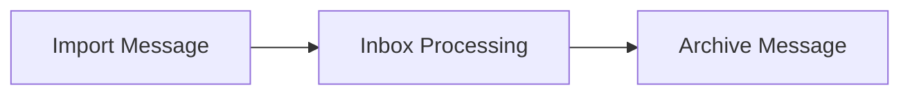

# MailScripts

The MailScripts project is a collection of scripts used to connect various MacOS applications with DEVONthink to automate daily document and email workflows.

## Overview

## Workflows

[Import Email Workflow](Docs/import-email-workflow.md)
