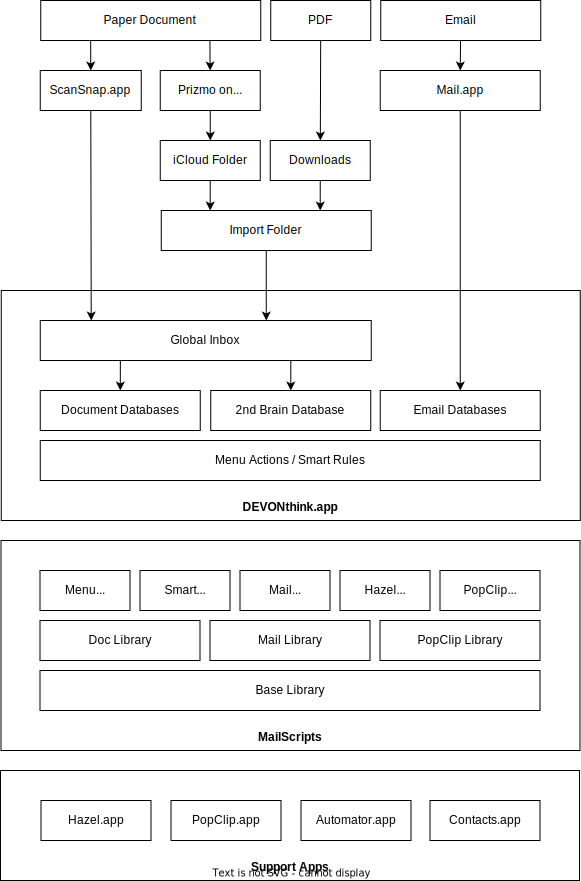

# MailScripts

The MailScripts project is a collection of scripts to integrate various MacOS applications with DEVONthink to support and automate my daily document and email management workflows.

## Overview

## Workflows

My email workflow follows the Inbox Zero methodology and works as follows:

1. [Import Message](Docs/import-email-workflow.md) to:
	- import the mail message into DEVONthink
	- move the message in proper inbox folder in DEVONthink, based on contacts group where the sender is member
	- move the original mail message from the Inbox to the archive folder in Mail  
2. Inbox Processing to:
	- move message to different inbox (this automatically moves to sender to the corresponding group in Contacts)
	- tag the message with the project/area (according to PARA methodology)
	- process and optionally cross-reference the message in project work products 
3. Archive Message
	- move message to the archive folder

